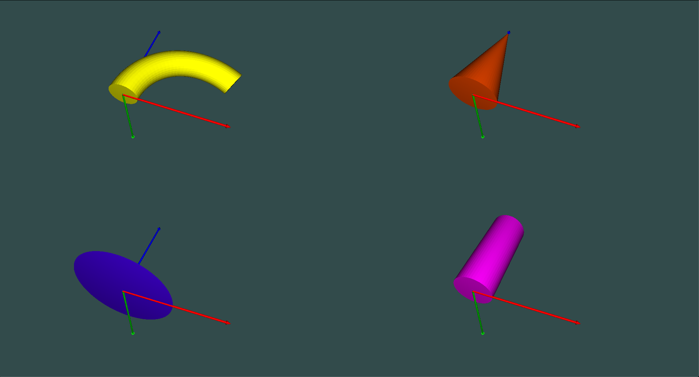
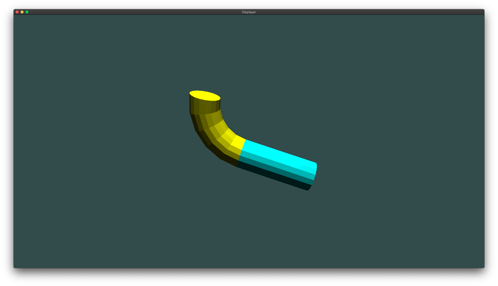
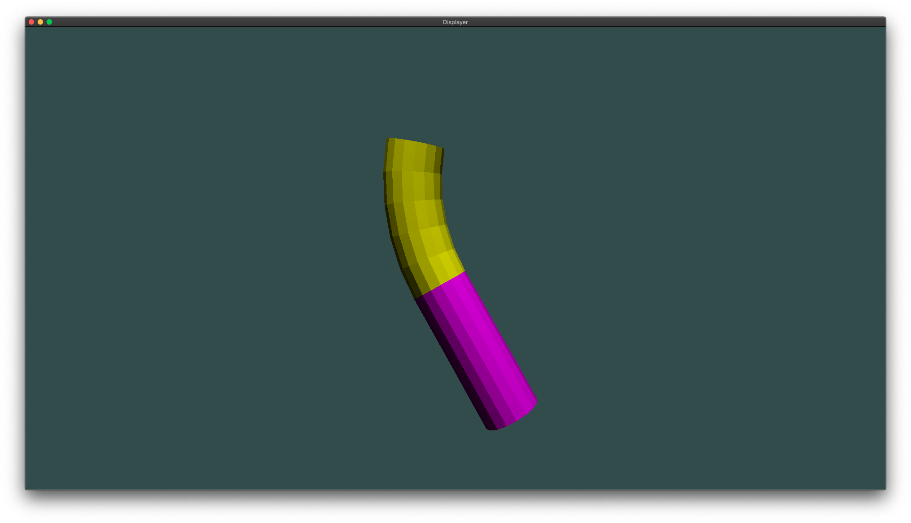
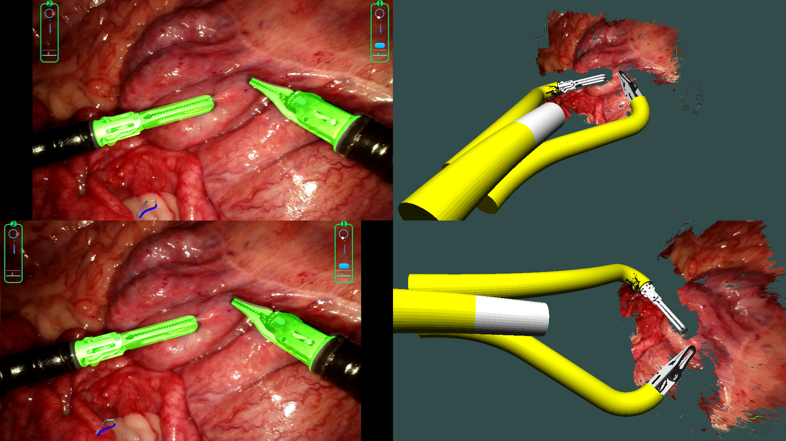

# lib_layer_renderer

This module is splited from one of my project (_which was designed as a static library mainly for rendering continuum-based surgical robot and gripper_).

Currently, this library is modularized for rendering shapes, model, vertices, and graph based on OpenGL. 

## Brief Introduction

The currently supported layer type include 
```C++
LAYER_BACKGROUND,     //!< For rendering 2D texture/image in 2D/3D way
LAYER_CIRCLE,         //!< For rendering circle shape
LAYER_CYLINDER,       //!< For rendering cylinder model
LAYER_SEGMENT,        //!< For rendering continuum segment
LAYER_CONE,           //!< For rendering cone model
LAYER_COORDINATE,     //!< For rendering coordinate
LAYER_END_EFFECTOR,   //!< For surigcal end-effector
LAYER_TEXTURE3D,      //!< For rendering 3D colored point cloud
```

A multiview example with 4-different object (_yellow segment, orange cone, blue circle, and magenta cylinder_) is shown below.



Two single-view example is shown below
<table>
    <tr><th> Segment + Cylinder </th> <th> Segment + Cylinder </th>
    </tr>
    <tr><td>  </td>
    <td>  </td>
    </tr>
</table>


Another multiview example with awesome rendered results is shown below.




## Requirements

+ [lib_math](https://github.com/wlfrii/lib_math) - which can be found in my git repository and includes some useful calculation utilities.
+ [gl_util](https://github.com/wlfrii/learn_OpenGL/tree/main/gl_util) - which can be found in my git repository and includes some rearranged interfaces for rendering on GLFW window.

Some other requirements can be found in the two required modules above.

## How to use

### I. Use the library (Tested on Mac OS)

Download this repository to your project as a subdirectory, and configure your CMakelists as follows: 

```cmake
add_subdirectory(lib_layer_renderer)
...

target_include_directories(${PROJECT_NAME}
    PUBLIC
        $<BUILD_INTERFACE:${CMAKE_CURRENT_SOURCE_DIR}/lib_layer_renderer/export>
    ...
)
target_link_libraries(${PROJECT_NAME}
    PUBLIC    
        lib_layer_renderer
    ...
)

```

A breif useage of this library is given as follows. __NOTE__: The `LayerRenderer` object should always be constructed first to initilize GL context.

```c++
#include <lib_layer_renderer.h>

int main()
{
    // Set a rendering mode
    mlayer::LayerRenderMode mode = mlayer::LAYER_RENDER_LEFT;
    // Create a gl_util::Projection
    gl_util::Projection gl_proj(1120, 960, 540, 1920, 1080, 0.2, 150);
    // Create LayerRenderer object
    mlayer::LayerRenderer renderer(gl_proj, mode);

    // (Optional)
    renderer.setView(...);
    renderer.setModel(...);

    // Add a layer to the renderer
    renderer.addLayers(std::make_shared<mlayer::LayerCylinder>(
                       20, 4, glm::vec3(1.0, 0.0, 1.0)));

    // Show the rendered results
    renderer.render();

    return 0;
}
```

__More Detailed useage of this library__ could be found in [`examples/`](https://github.com/wlfrii/lib_layer_renderer/tree/main/examples) folder.

The renderer window support keyboard control defaultly. The supported keys include 
+ Quit: `ESC` 
+ Model Translation: `W S A D Q E`
+ Model Rotation: `I O K J , .`

Note, there should be a `models` folder that stores some gripper STL model. However, these files will not be uploaded due to usage restriction.