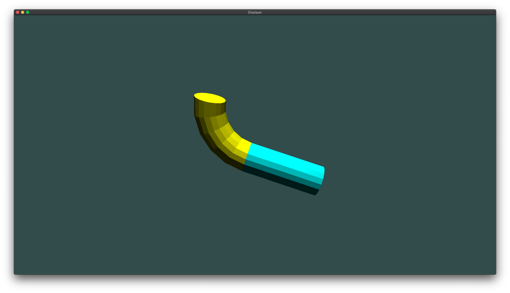
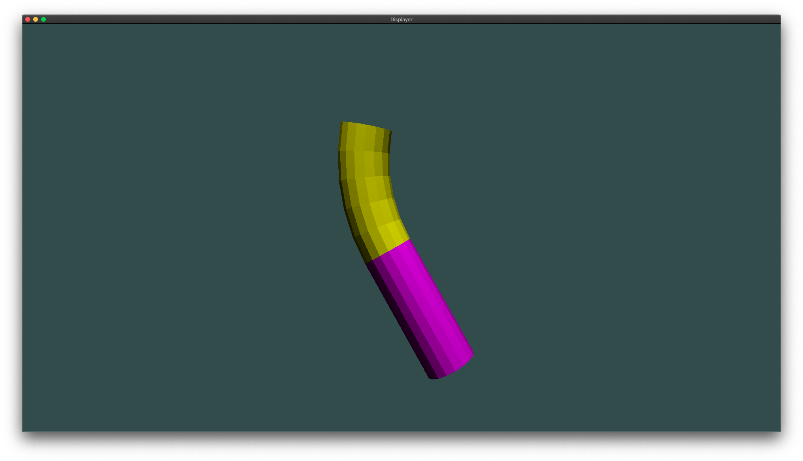
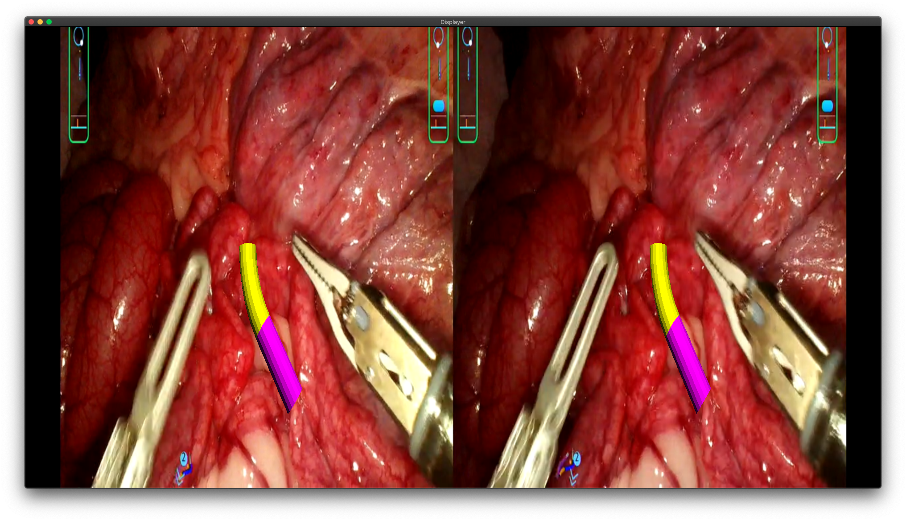
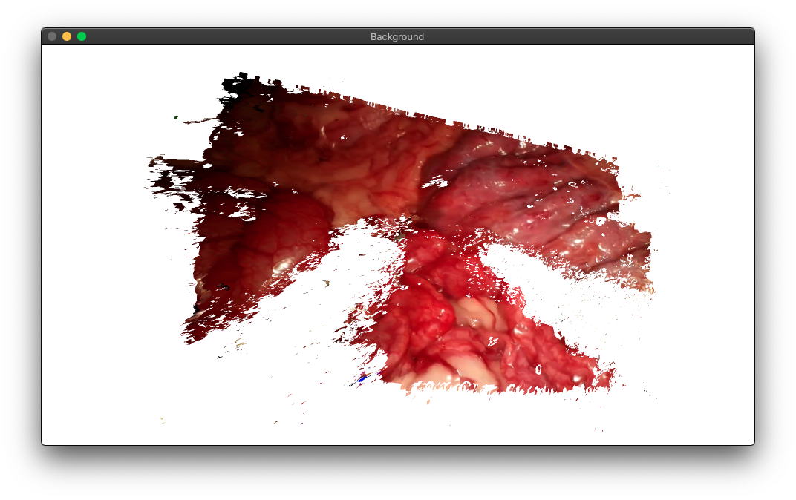

# RenderLayer

This module is splited from XXXX project (_which was designed as a static library mainly for rendering continuum-based surgical robot and gripper_).

Currently, this library is modularized for rendering shapes, model, vertices, and graph based on OpenGL.

## Requirements

+ [lib_math](https://github.com/wlfrii/lib_math) - which can be found in my git repository and includes some useful calculation utilities.
+ [gl_util](https://github.com/wlfrii/learn_OpenGL/tree/main/gl_util) - which can be found in my git repository and includes some rearranged interfaces for rendering on GLFW window.

Some other requirements can be found in the two required modules above.

## Brief Introduction

The rendering mode in this library include 
```C++
LAYER_RENDER_LEFT       // Only rendering left view
LAYER_RENDER_RIGHT      // Only rendering right view
LAYER_RENDER_STEREO     // Rendering stereo view
```

The currently supported layer type include 
```C++
LAYER_BACKGROUND    // See <layer_background.h>
LAYER_CYLINDER      // See <layer_cylinder.h>
LAYER_SEGMENT       // See <layer_segment.h>
LAYER_GRIPPER       // See <layer_gripper.h>
LAYER_TEXTURE3D     // See <layer_texture3d.h>
```

Some rendered results based on this library are shown below in the table, which shows (from left to right and top to bottom)

 + a yellow __Segment__ (with greater _theta_) connected with a cyan __Cylinder__;
 + a yellow __Segment__ (with smaller _theta_) connected with a magenta __Cylinder__
 + a stereo view that includes a yellow __Segment__ connected with a manenta __Cylinder__ and a stereo endoscopic image __Background__;
 + a __3DTexture__ view with white window background.

<table>
    <tr><th> Segment + Cylinder </th> <th> Segment + Cylinder </th>
    </tr>
    <tr><td>  </td>
    <td>  </td>
    </tr>
    <tr><th> (Stereo) Segment + Cylinder + Background </th> <th> 3D Texture </th>
    </tr>
    <tr><td>  </td>
    <td>  </td>
    </tr>
</table>


More __useage details of this library__ could be found in [`test`](https://github.com/wlfrii/EndoVision/tree/main/RenderLayer/test) folder, which includes several test files.

Note, there should be a `models` folder that stores some gripper STL model. However, these files will not be uploaded due to usage restriction.